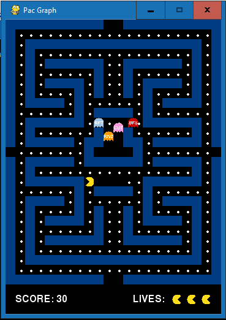

# Pac Graph
Applying the Breadth First Search (BFS) algorithm to the classic arcade game "Pacman". Adapted for keyboard or EEG controls.

## Breadth First Search
The Breadth First Search algorithm finds the shortest distance between any two given points on a matrix by assigning a "step" value to each traversable coordinate through a method of iteration. Each "ghost" in the game models this algorithm by applying it in a different strategy.
* **Blinky (Red):** Blinky will find the shortest path between itself and your player using BFS, and move directly in that path. This ghost will chase you.
* **Pinky (Pink):** Pinky will check your direction of movement and predict where you will be based off of where the closest wall is in the direction you are travelling, and conduct BFS from its postion to the predicted point. This ghost will cut into your path.
* **Inky (Blue):** Inky will use BFS to travel to the point created by reflecting Blinky's position on the perpindicular line created by Pinky's predicted point in relation to Blinky's position, adjusted to a point without any wall. This ghost will trap you.
* **Clyde (Orange):** In order to compare BFS to less effective algorithms in juxtaposition, Clyde follows a randomly generated path that is modified to prevent repetition. This ghost will wander about.

## EEG Implementation
This game has been adapted for Emotiv EEG headset users. Using EEG technology, a set of commands based off of the user's neurological state can be used to navigate the player rather than using the keyboard. By making it an EEG application, users suffering from physical impairments can also enjoy the game of Pacman.
